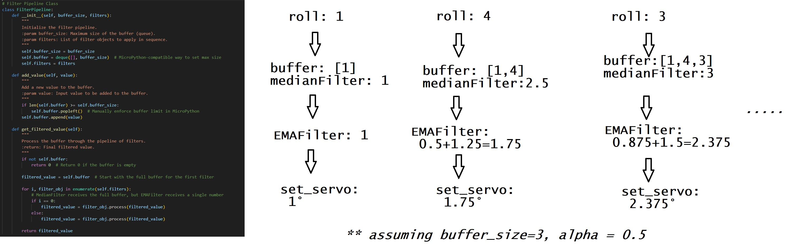
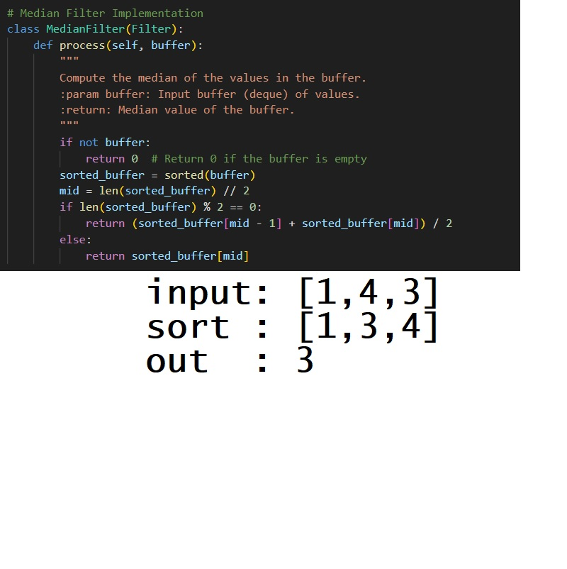
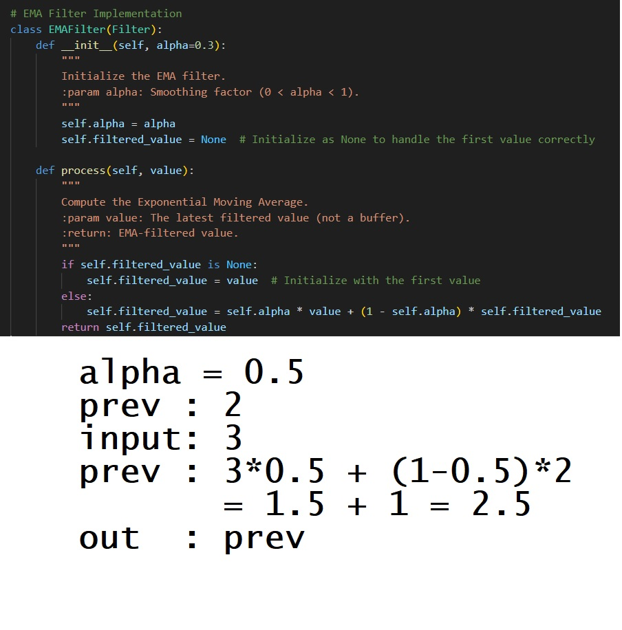

# ADXL335_GY_61

gyro stabalization example using a GY_61 3 axis accelerometer

<video width="320" height="240" controls>
  <source src="docs/assets/roll_stabilization_480.mp4" type="video/mp4">
  Your browser does not support the video tag.
</video>

# Pipeline Overview

# Median Filter

# EMAFilter

