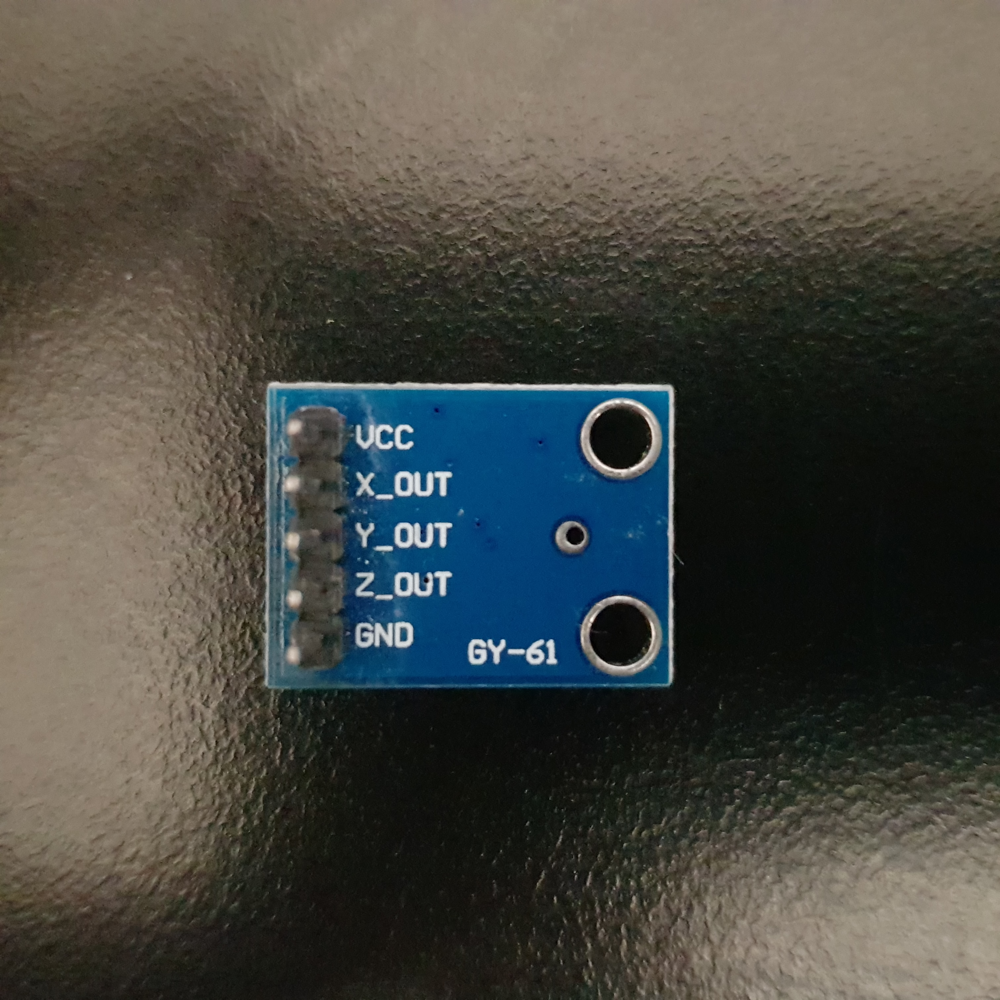
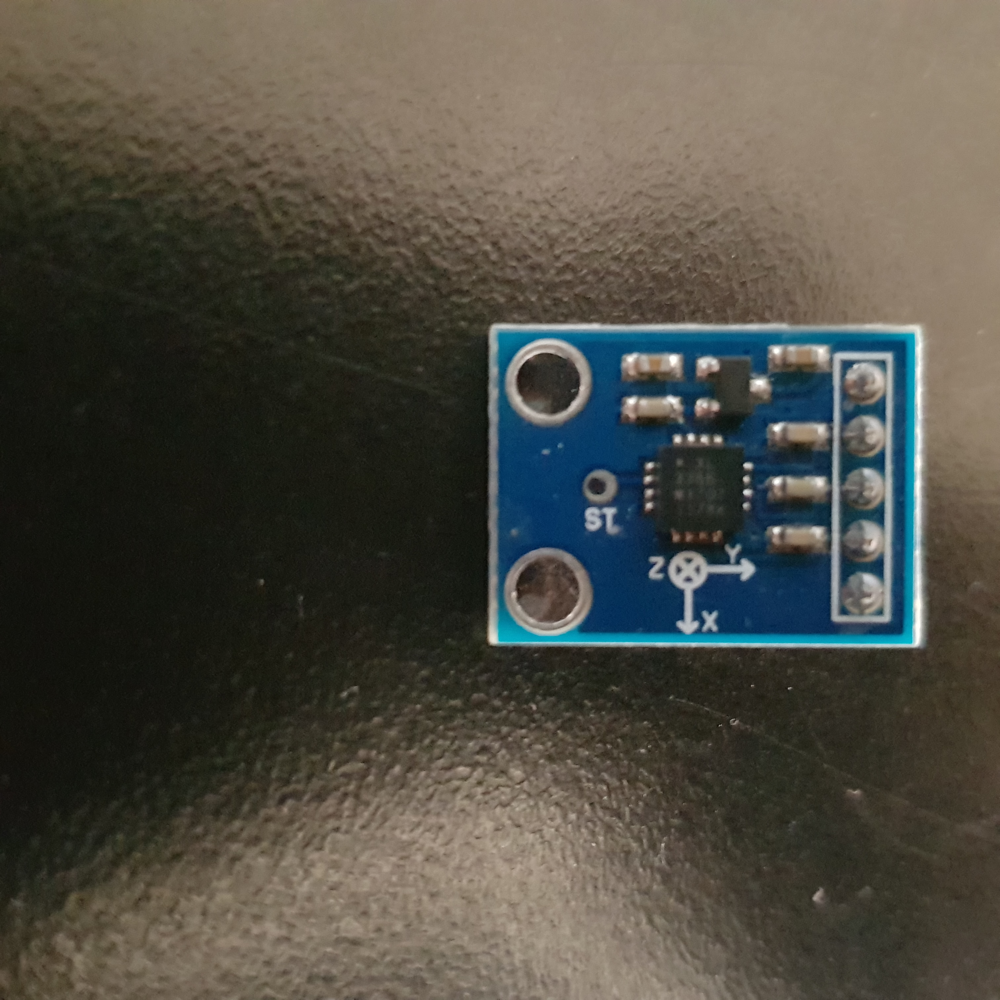

# ADXL335_GY_61

gyro stabalization example using a GY_61 3 axis accelerometer

https://github.com/user-attachments/assets/e8c7762f-361b-48a3-b0e1-a65320089c45

# Module

# Pinout

# Pipeline Overview

# Median Filter

# EMAFilter

